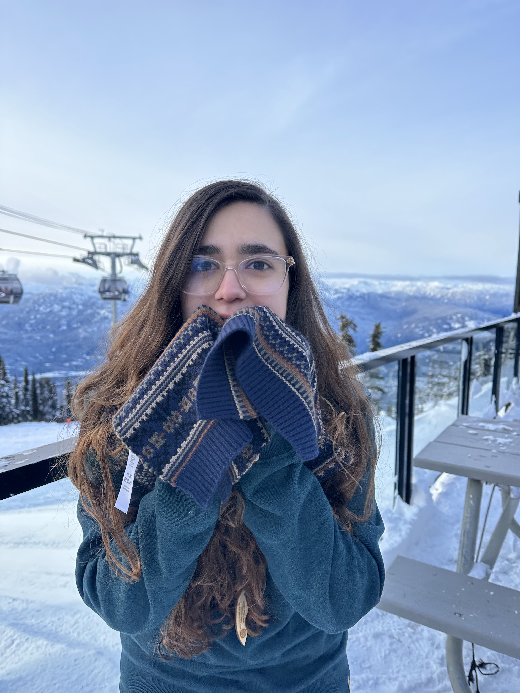

## About Me

I'm an honors student at Fairleigh Dickinson University, where I'm studying Computer Science with a concentration in Cybersecurity and a minor in Mathematics.

I started my undergraduate at Cornell University, where I was recognized as a [Meinig Family Cornell National Scholar](https://scl.cornell.edu/get-involved/cornell-commitment/meinig-family-cornell-national-scholars/membership). I'm continuing my degree at FDU, where I'm an active member of their [Honors Program](https://www.fdu.edu/academics/honors/university-honors-program/) and maintain a 4.0 GPA. I'm currently conducting CAHSI research in Cybersecurity & Machine Learning with Professor [Neelu Sinha](https://www.fdu.edu/profiles/neelu_sinha/). My honors thesis project in Cybersecurity is being mentored by Professor [Ihab Darwish](https://www.linkedin.com/in/ihab-darwish-phd-pmp-a2b305b/). In my free time, I have been studying for the Security+ Exam which I will be taking during spring break of 2024.

 I am pursuing an internship in the Cybersecurity industry for the Summer of 2024. I'm open to work and am always welcoming new connections!

## Activities

🔬 <b>CAHSI Local Research</b>   
I'm currently conducting mentored research as part of the CAHSI Local REU program, and engaging in training to strengthen my computing, communication, and professional skills. I'm creating a research plan, maintaining a journal to report on research progress, and creating a research poster to disseminate my research results.   
   
🎲 <b>Founder of FDU Game Dev</b>   
Within my first semester at Fairleigh Dickinson, I founded FDU Game Dev, a club where students of any discipline can explore the creation of games and collaborate to make a game of our own. As President, I leverage my expertise in leadership and game development to guide the Executive Board, strategically plan weekly meeting agendas, and provide hands-on support to members throughout the game creation process. Through this initiative, I demonstrate my ability to effectively lead teams, cultivate a supportive community, and translate creative visions into tangible projects within the span of a semester.

## Honors & Awards

Year | Award | Description
-----|-------|--------
2024 | NRHC Presenter | I was accepted to present my independent research at the Northeast Regional Honors Council Conference in Albany, NY. In April, I will conduct an academic panel presentation exploring how advencements in computing will lead to advancements in threats and risks to our personal data.
2023 | Honors List | Awarded for achieving a minimum grade point average of 3.5 for the semester. For the Fall 2023 semester, I was able to achieve a perfect 4.0 GPA.
2023 | FDU Honors Program | Includes research, honors-only study abroad trips, and honors courses.
2022 | Dean's List | Given to students at Cornell University with a grade point average of 3.5 or above.
2021 | Meinig Family Cornell National Scholar | Selective honors program for less than 2% of incoming undergraduates who demonstrate unparalleled leadership skills.

## Coursework

Year | Course
-----|-------
2024 | Cryptography
2024 | Cybersecurity
2024 | Operating Systems
2024 | Info Security Design & Management
2024 | Crime & Criminology
2023 | Computer Ethics
2023 | Data Comm & Computer Networks
2023 | Artificial Intelligence
2022 | Computer Organization
2022 | Multi-Variable Advanced Calculus
2022 | Data Structures & Functional Programming
2022 | Discrete Structures
2022 | Linear Algebra
2021 | Object Oriented Design & Data Structures
2021 | Intermediate C++ Programming
